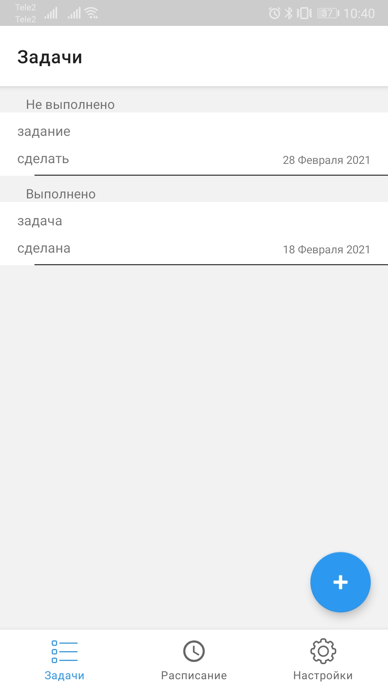
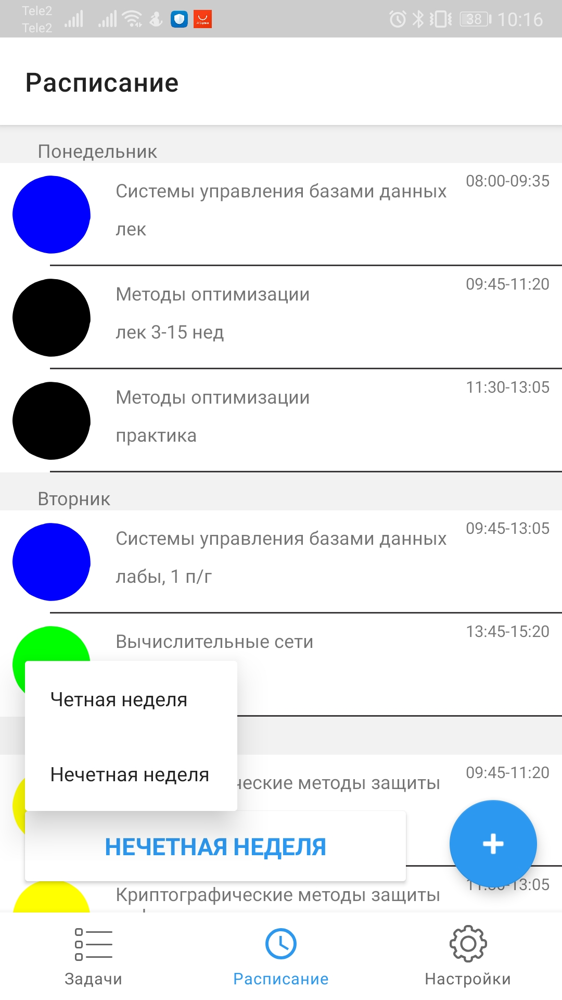
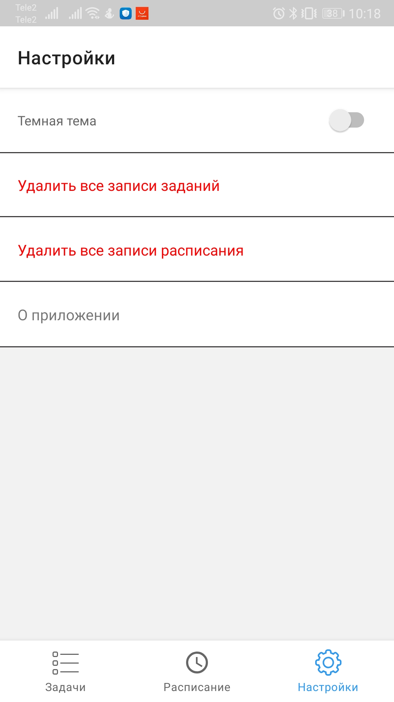
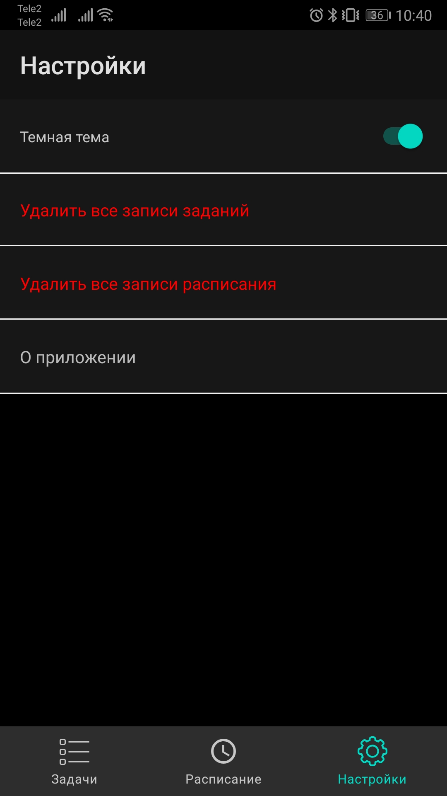
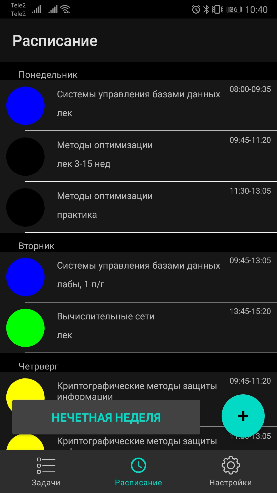
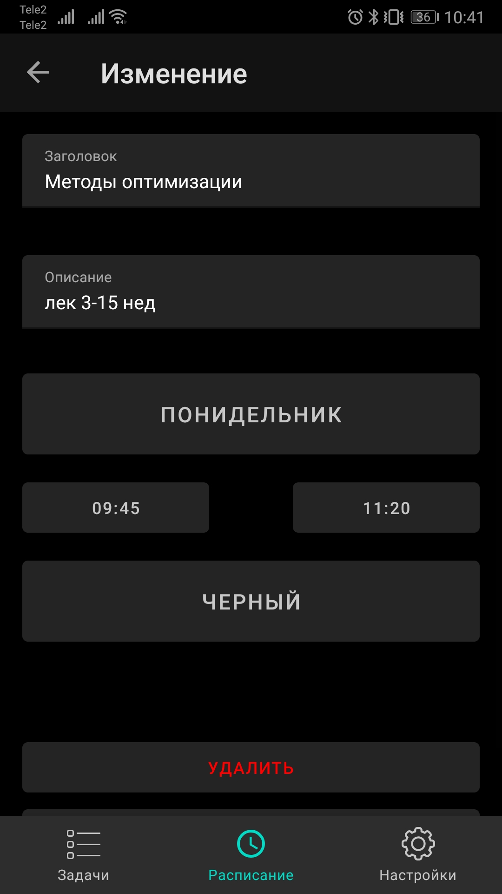

# MySchedule

## Idea

Simple app that you can use to create todo list and your study timetable.
The todo list has a local database and the schedule has a shared database in the cloud.
Objects can be deleted / changed / edited.

* [Trello](https://trello.com/b/yHv4yaxA/appschedule)

## How it looks

 

## What it uses

### Data

* [Room](https://developer.android.com/topic/libraries/architecture/room)
* [SharedPreferences](https://developer.android.com/reference/kotlin/android/content/SharedPreferences)
* [Firebase](https://firebase.google.com/docs/android/setup)

### Android Architecture Components

* [LiveData](https://developer.android.com/topic/libraries/architecture/livedata)
* [ViewModel](https://developer.android.com/topic/libraries/architecture/viewmodel)
* [Navigation](https://developer.android.com/topic/libraries/architecture/navigation/)

### Others

* [Timber](https://github.com/JakeWharton/timber) -  a logger with a small, extensible API which provides utility on top of Android's normal Log class.
* [Material Components](https://github.com/material-components/material-components-android)
